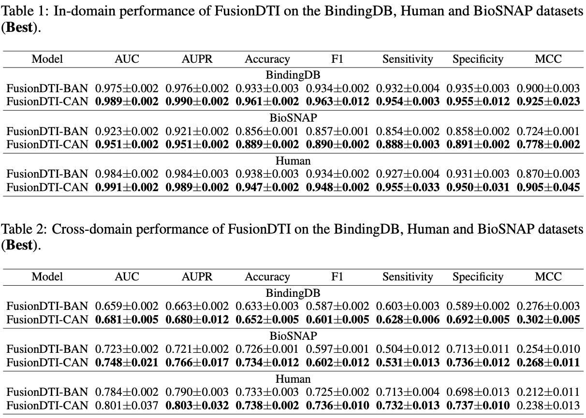

# FusionDTI

<div align="left">

[](https://zhaohanm.github.io/FusionDTI.github.io/)
[](https://arxiv.org/abs/2406.01651)
[](https://huggingface.co/spaces/Gla-AI4BioMed-Lab/FusionDTI)

</div>

## 🚀 Introduction

FusionDTI utilises a **Token-level Fusion module** to effectively learn fine-grained information for Drug-Target Interaction Prediction. In particular, our proposed model uses the **SELFIES** representation of drugs to mitigate sequence fragment invalidation and incorporates the **structure-aware (SA)** vocabulary of target proteins to address the limitation of amino acid sequences in structural information, additionally leveraging **pre-trained language models (PLMs)** extensively trained on large-scale biomedical datasets as encoders to capture the complex information of drugs and targets.

## 🧩 Framework


## ⚙️ Installation Guide

Clone this Github repo and set up a new conda environment.
```
# create a new conda environment
$ conda create --name FusionDTI python=3.8
$ conda activate FusionDTI

# install requried python dependencies
$ conda install pytorch==1.12.1 torchvision==0.13.1 torchaudio==0.12.1 cudatoolkit=11.3 -c pytorch
$ pip install transformers
$ pip install wandb

# clone the source code of FusionDTI
$ git https://github.com/ZhaohanM/FusionDTI.git
$ cd FusionDTI
```
## 📂 Datasets

All data used in FusionDTI are from public resource: [BindingDB](https://www.bindingdb.org/bind/index.jsp) [1], [BioSNAP](https://github.com/kexinhuang12345/MolTrans) [2] and [Human](https://github.com/lifanchen-simm/transformerCPI) [3]. The dataset can be downloaded from [here](https://github.com/peizhenbai/DrugBAN/tree/main/datasets).

## 🏋️‍♀️ Training

For the experiments with FusionDTI, you can directly run the following command. The dataset could either be  `BindingDB`, `Biosnap`, and `Human`. 
```
$ python main_token.py --dataset BindingDB
``` 
## 🔍 Inference

After training the FusionDTI model, the best saved model is used to inference a single drug and target pair. In [visualize_attention.ipynb](visualize_attention.ipynb), we provide the function of entering protein and drug sequences to visualise attention weights.

```
$ python attention.py --dataset BindingDB
``` 

## How to obtain the structure-aware sequence of protein?

The structure-aware sequence of protein is based on 3D structure file (.cif) using Foldseek from the [AlphafoldDB](https://alphafold.ebi.ac.uk) database.
[SaProt](https://github.com/westlake-repl/SaProt?tab=readme-ov-file) provides a function to convert a protein structure into a structure-aware sequence. The function calls the [foldseek](https://github.com/steineggerlab/foldseek) binary file to encode the structure. You can download the binary file from [here](https://drive.google.com/file/d/1B_9t3n_nlj8Y3Kpc_mMjtMdY0OPYa7Re/view?usp=sharing) and place it in the `utils` folder. 

The following three steps are the obtainment process:

Step 1: If you do not have protein structure files, you will need to obtain them from the [AlphafoldDB](https://alphafold.ebi.ac.uk) database via the UniProt IDs on the [UniProt website](https://www.uniprot.org). The UniProt IDs are then saved as a comma-delimited text file.

Step 2: Retrieve protein structure files from AlphafoldDB through corresponding UniProt IDs.
```
$ python get_alphafold.py
```
Step 3: The structure-aware protein sequences are obtained with 3D structure files (cif).
```
$ python generate_stru_seq.py
```
## How to obtain SELFIES of drug?

Install the Python package that converts SMILES strings to SELFIES strings.
```
$ pip install selfies 
$ pip install pandarallel
```
Run the following code to generate SELFIES based on your SMILES.
```
$ python generate_selfies.py
```
## 🔬 Pretrained Language Models

### 🧬 Protein Language Models

| Model Name | HuggingFace Link | Input Type |
|------------|------------------|-------------|
| ESM2 | [facebook/esm2_t33_650M_UR50D](https://huggingface.co/facebook/esm2_t33_650M_UR50D) | Amino Acid Sequence |
| SaProt | [westlake-repl/SaProt_650M_AF2](https://huggingface.co/westlake-repl/SaProt_650M_AF2) | Structure-aware Sequence |
| SaProt | [westlake-repl/SaProt_650M_PDB](https://huggingface.co/westlake-repl/SaProt_650M_PDB) | Structure-aware sequence |

### 💊 Molecular Language Models

| Model Name | HuggingFace Link | Input Type |
|------------|------------------|-------------|
| MoLFormer-XL | [ibm-research/MoLFormer-XL-both-10pct](https://huggingface.co/ibm-research/MoLFormer-XL-both-10pct) | SMILES |
| SELFormer | [HUBioDataLab/SELFormer](https://huggingface.co/HUBioDataLab/SELFormer) | SELFIES |
| SELFIES-TED | [ibm-research/materials.selfies-ted](https://huggingface.co/ibm-research/materials.selfies-ted) | SELFIES |


## 📈 Results



## 📖 Citation

Please cite our [paper](https://arxiv.org/abs/2406.01651) if you find our work useful in your own research.
```
@inproceedings{meng2024fusiondti,
title={Fusion{DTI}: Fine-grained Binding Discovery with Token-level Fusion for Drug-Target Interaction},
author={Zhaohan Meng, Zaiqiao Meng, Ke Yuan and Iadh Ounis},
booktitle={ICML 2024 AI for Science Workshop},
year={2024},
url={https://openreview.net/forum?id=SRdvBPDdXB}
}
```
